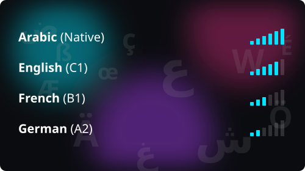

   
  

## `$ ./pet_snake.sh`

  <picture >
    <source media="(prefers-color-scheme: dark)" srcset="https://raw.githubusercontent.com/lynx1097/lynx1097/output/snake-dark.svg"/>
    <source media="(prefers-color-scheme: light)" srcset="https://raw.githubusercontent.com/lynx1097/lynx1097/output/snake.svg"/>
    
  </picture>

## `$ whoami`

Hi , I'm **Abdelrahman**, **aka Lynx**. I'm a backend engineer and a Computer Science-Software Engineering Senior at the German International University .

"Backend engineer" only describes my core . The rest of the time I'm a Linux enthusiast who compiles custom kernels for fun or writes local driver patches , I'm also an open-source contributor , an OS hopper who prefers the bare metal adventure rather than VMs, and the kind of person who'll happily disappear into a stubborn bootloader, or a smart watch exploit for more community features. 

I think of myself as a **generalist -multi-talented- who takes a sip from every cup**. In addition to what I learned at the uni I'm self-taught as I like to try and disassemble everything , get to its origins and follow my curiosity , I learn fast and efficiently, and I'm just as comfortable reinventing the wheel as building on someone else's. 

## `$ cat how-i-work.md`

### **I don't vibe-code.**
> I can , but I mainly treat AI as one tool on the bench, blended with my own **expertise, critical thinking, engineering skillset and deep research** . 

### **How I figure things out**
> I search the web the old-fashioned way: Google (I may reach results page 50 !), Meta Exchange communities , reddit or reading docs until it genuinely clicks , That's how I acquired most of my knowledge and how it sticks to my brain , and I still use AI for quick help with generic info or remembering something I forgot .

### **I never give up easily**
> When I hit a problem with **no answer anywhere online** , I stop searching and **craft my own patch.** That's usually where the interesting work begins.

### **My favourite side path**
>I started lately contributing to some academic OSS projects , and I recently joined [AUR](https://aur.archlinux.org/) to work on pantheon DE out of the box support for arch linux, I'm also trying to join the active development team of [haikuOS](https://www.haiku-os.org/) , and I am a volunteering web development engineer in the Egyptian Mathematical Foundation .

## `$ ls ~/soft-skills`

The code is the easy part. Here's what I actually bring to a team:
| |  | |
|:--:|:--|:--|
| 🧭 | **Leadership** | I lead projects end-to-end , setting direction, owning scope, and keeping things moving all the way to delivery. |
| 🚀 | **Self-Taught & Fast-Learning** | Most of what I know, I taught myself. Drop me into an unfamiliar stack and I'll be productive faster than you'd expect. |
| 🧩 | **Problem-Solving** | I'm at my best when the path isn't obvious. I decompose messy problems and work them until they give. |
| 🔀 | **Adaptability** | Backend, desktop, mobile, DevOps, hardware , I move between them without losing momentum. |
| 🛠️ | **Ownership & Follow-Through** | If I start it, I finish it , and I maintain it. I don't leave loose ends behind. |
| 🗣️ | **Communication** | I can explain a technical decision to an engineer or to a non-technical stakeholder and have both walk away clear. |
| 🎓 | **Mentoring & Teaching** | I enjoy breaking concepts down and bringing other people up to speed. |
| 🤝 | **Collaboration** | I work well across disciplines and give back through open source. |
| 🧱 | **Resilience** | I don't bounce off hard problems. I debug, thoroughly research, and grind until it works. |
| 🔍 | **Attention to Detail** | Clean architecture, edge cases, and the small polish that separates *"it works"* from *"it's done well."* |

# A full list of my technical skillset is available [here](https://lynx1097.github.io/lynx1097#skills) !

## `$ ls ~/toolbox`

  
  

## `$ locale -a`

  

## `$ ./connect --me`

  <!-- FILL: replace the placeholder hrefs (#) and the email below with your real ones -->
 
  
  
  

    

  

  

